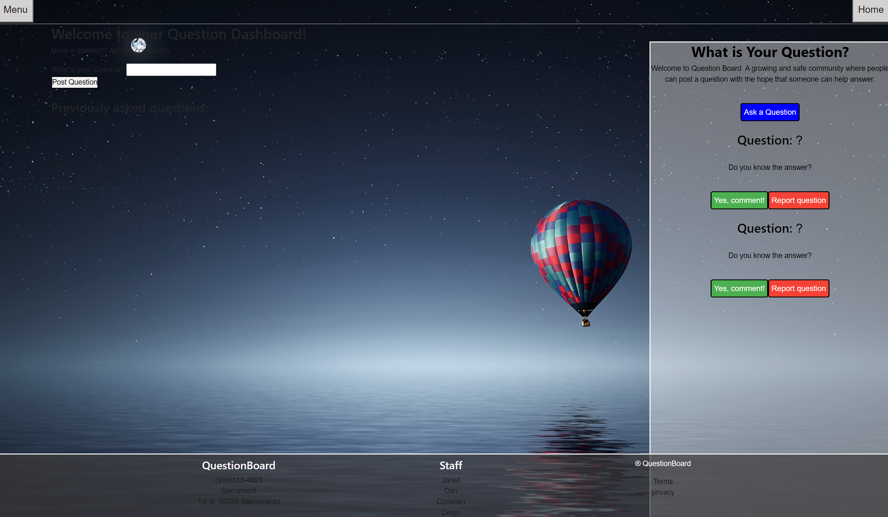

[![Contributors][contributors-shield]][contributors-url]
[![Forks][forks-shield]][forks-url]
[![Stargazers][stars-shield]][stars-url]
[![Issues][issues-shield]][issues-url]
[![MIT License][license-shield]][license-url]

<!-- PROJECT LOGO -->
 

    

  <h3 align="center">Question Forum README</h3>

  

    Welcome to the Question Forum README, a great spot to get to know this project!
     
    <a href="https://github.com/crangel93/questionBoard"><strong>Explore the docs »</strong></a>
     
     
    <a href="https://crangel93.github.io/questionBoard/">View Demo</a>
    ·
    <a href="https://github.com/crangel93/questionBoard/issues">Report Bug</a>
    ·
    <a href="https://github.com/crangel93/questionBoard/issues">Request Feature</a>
  

<!-- TABLE OF CONTENTS -->

  
Table of Contents

  <ol>
    <li>
      <a href="#about-the-project">About The Project</a>
      <ul>
        <li><a href="#built-with">Built With</a></li>
      </ul>
    </li>
    <li><a href="#getting-started">Getting Started</a></li>
    <li><a href="#usage">Usage</a></li>
    <li><a href="#roadmap">Roadmap</a></li>
    <li><a href="#contributing">Contributing</a></li>
    <li><a href="#license">License</a></li>
    <li><a href="#contact">Contact</a></li>
    <li><a href="#acknowledgments">Acknowledgments</a></li>
  </ol>

<!-- ABOUT THE PROJECT -->
## About The Project

This app offers a safe, fun and creative way for people to ask questions. A user can post a question and a member of the Question Board Community can login and answer the question.

(<a href="#readme-top">back to top</a>)

### Built With

Below are the following technologies and applications utilized to help build the app. 

VS Code 
JavaScript 
HTML 
Node.js 
Mongo 
Inquirer 
React 
Heroku 

(<a href="#readme-top">back to top</a>)

<!-- GETTING STARTED -->
## Getting Started

Below you'll be able to see screen shots of the deployed app. You can also view the road map to see how you can test it locally.

(<a href="#readme-top">back to top</a>)

<!-- USAGE EXAMPLES -->
## Usage

Please enjoy a video tutorial showing how the app is used. 
Click <a href="https://youtu.be/YzokMVnqdRM">Here</a> below to view the tutorial 

Here's a screen shot of what the app looks like when someone is viewing it at different stages. 

 

(<a href="#readme-top">back to top</a>)

<!-- ROADMAP -->
## Roadmap

Click "ask a question" 
You must be logged into an account to post or answer a question 
Enter your login information or sign up 
Inside the dashboard, you can create a new question or view your previously asked questions 
If you know the answer to a question, you may comment the answer 

See the [open issues](https://github.com/crangel93/questionBoard/issues) for a full list of proposed features (and known issues).

(<a href="#readme-top">back to top</a>)

<!-- CONTRIBUTING -->
## Contributing

We strongly feel that contributing well throught and engaging suggestions are instrumental. We are avid learners and want to let you know any contribution or suggestions are apprecaited.

If you truly believe you can contribute to making this app better, please fork the repo and create a pull request. If you do not wish to fork, you can open and create an issue with the tag "enhancement" or "suggestions". It will then be reviewd and taken into consideration. Lastly, please don't forget to give the project a star!

1. Fork the Project
2. Create your Feature Branch (`git checkout -b feature/newSuggestion`)
3. Commit your Changes (`git commit -m 'Add some NewSuggestion'`)
4. Push to the Branch (`git push origin feature/NewSuggestion`)
5. Open a Pull Request

(<a href="#readme-top">back to top</a>)

<!-- LICENSE -->
## License

Distributed under the MIT License. 
Copyright (c) 2022 Christian Rangel, Jared Saldate, Dan Poggetti & Diego Pena 
See License.text for more information.

(<a href="#readme-top">back to top</a>)

<!-- CONTACT -->
## Contact

Christian Rangel - Github [https://github.com/crangel93]

Jared Saldate - Github [https://github.com/saldatecode]

Dan Poggetti - GitHub [https://github.com/danpoggetti]

Diego Pena - Github [https://github.com/diegop2022]

Project Repo: [https://github.com/crangel93/questionBoard]

Demo Link: [https://crangel93.github.io/questionBoard]

Video Link: [https://youtu.be/YzokMVnqdRM]

(<a href="#readme-top">back to top</a>)

<!-- ACKNOWLEDGMENTS -->
## Acknowledgments

I want to acknowledge the many great and vast resouces that aided me in developing this app.

* [Google](https://www.google.com)
* [YouTube](https://www.youtube.com)
* [GitHub Pages](https://pages.github.com)
* Instructional Staff
* [README Template courtesy of othneildrew](https://github.com/othneildrew/Best-README-Template)
* [MIT License text](https://mit-license.org/license.txt)
* [Shields.io for badges](https://shields.io/)

(<a href="#readme-top">back to top</a>)

<!-- MARKDOWN LINKS & IMAGES -->
<!-- https://www.markdownguide.org/basic-syntax/#reference-style-links -->
[contributors-shield]: https://img.shields.io/github/contributors-anon/crangel93/questionBoard?style=for-the-badge
[contributors-url]: https://github.com/crangel93/questionBoard/graphs/contributors
[forks-shield]: https://img.shields.io/github/forks/crangel93/questionBoard?style=for-the-badge
[forks-url]: https://github.com/crangel93/questionBoard/network/members
[stars-shield]: https://img.shields.io/github/stars/crangel93/questionBoard?style=for-the-badge
[stars-url]: https://github.com/crangel93/questionBoard/stargazers
[issues-shield]: https://img.shields.io/github/issues/crangel93/questionBoard?style=for-the-badge
[issues-url]: https://github.com/crangel93/questionBoard/issues
[license-shield]: https://img.shields.io/github/license/crangel93/questionBoard?style=for-the-badge
[license-url]: https://github.com/crangel93/questionBoard/blob/main/LICENSE
[product-screenshot]: images/screenshot.png
